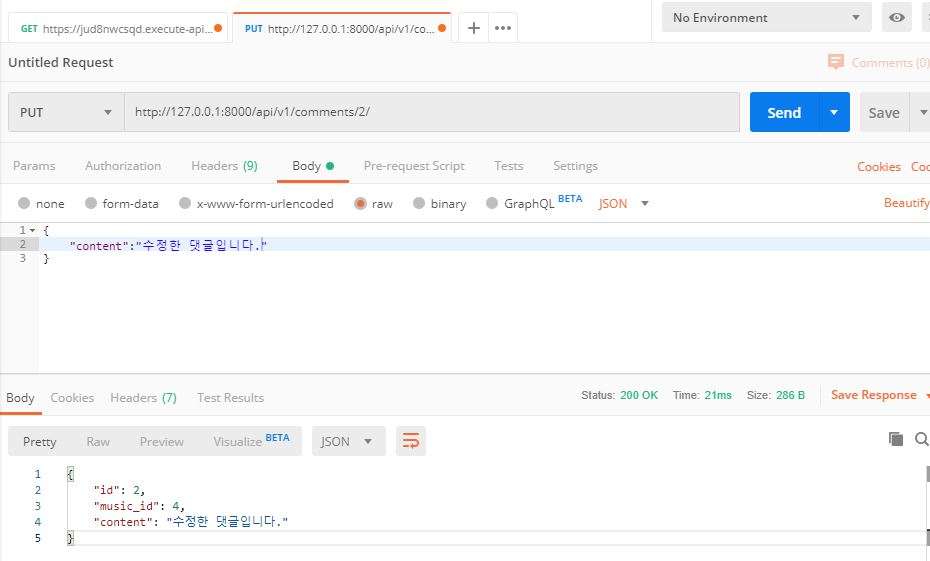

drf

django res framework


# API 와 외부DB 연동

구글에 jsonplaceholder 검색

 https://jsonplaceholder.typicode.com/ 

PUT, PATCH, DELETE 요청

URL은 리소스를 나타내고, METHOD는 리소스에 대한 행위를 나타낸다.

1. GET
   - /posts  :  전체 posts 목록.
   - /posts/1  :  1번 post.
   - /posts/1/comments  :  1번 post에 달린 모든 댓글.
   - /comments?postId=1  :  postId가 1인 post의 모든 댓글.
   - /posts?userId=1  :  userId가 1번인 user가 작성한 모든 posts.
2. POST
   - /posts : 하나의 post를 생성하겠다.
3. PUT
   - /posts/1  :  1번 post를 수정하겠다.
   - PUT은 모든 유저 정보를 전달해야 한다.
4. PATCH
   - /posts/1  :  1번 post를 수정하겠다.
   - 수정하고 싶은 field만 데이터에 담아서 요청을 보내도 된다.
5. DELETE
   - /posts/1  :  1번 post를 삭제하겠다.

 https://www.getpostman.com/ 

Postman : 개발한 API를 테스트하고, 그 결과를 공유할 수 있는 플랫폼.

request에 https://jsonplaceholder.typicode.com/posts/ 와 같이 요청하면 된다.

POST는 json 딕셔너리 형태로 요청하는 data를 body에 담아서 보낸다.

## JSON

- JavaScript Object Notation
- 파이썬의 리스트와 딕셔너리를 합친 형태
- 파이썬의 딕셔너리와 같이 key - value 쌍으로 이루어진 형식을 JS에서는 object라고 부른다.
- 파이썬의 딕셔너리와 JS의 Objects는 내부적인 구현 방식 등에서 차이가 존재해 호환이 불가능하지만 'key - value로 이루어진 데이터'라는 공통점이 존재한다.
- JSON은 이러한 공통점을 이용하여 서로 다른 언어 간에 데이터 object를 전달하기 위해 인간이 읽을 수 있는 텍스트(string)를 사용한다. 

ctrl + shift + i 에서 Console : javascript를 실행할 수 있는 공간.


## Django API server 시작

```bash
# 가상환경 설치 후

$ pip list
$ python -m pip install --upgrade pip
$ pip install django
$ django-admin startproject api .
$ pip install djangorestframework
```


https://www.django-rest-framework.org/

settings.py

```bash
INSTALLED_APPS = [
    ...
    'rest_framework',
]
```


bash

```bash
# musics 생성
$ python manage.py startapp musics
```


settings.py

```python
INSTALLED_APPS = [
    # Local apps
    'musics',

    # Third party apps
    'rest_framework',

    # Django apps
    'django.contrib.admin',
    'django.contrib.auth',
    'django.contrib.contenttypes',
    'django.contrib.sessions',
    'django.contrib.messages',
    'django.contrib.staticfiles',
]
```


models.py

```python
from django.db import models

class Artist(models.Model):
    name = models.CharField(max_length=50)
    def __str__(self):
        return self.name

# artist.musics
class Music(models.Model):
    # Artist와 1:N 관계 
    artist = models.ForeignKey(Artist, on_delete=models.CASCADE, related_name='musics')
    title = models.CharField(max_length=200)
    def __str__(self):
        return self.title
    
class Comment(models.Model):
    # Music과 1:N 관계
    music = models.ForeignKey(Music, on_delete=models.CASCADE, related_name='comments')
    content = models.TextField()
    def __str__(self):
        return f'{self.music.pk}번 음악의 {self.pk}번 댓글'

```


```bash
$ python manage.py makemigrations
$ python manage.py migrate
```


admin.py

등록한 models를 admin 페이지에서 관리하기 위해 다음과 같이 register

```python
from django.contrib import admin
from .models import *

admin.site.register(Artist)

admin.site.register(Music)

admin.site.register(Comment)
```


admin 페이지에서 dummy 데이터 작성 후 bash에서 아래 코드 작성

```bash
# json 파일 format 으로 작성한 데이터들을 export 해준다.
$ python manage.py dumpdata --indent 2 musics > dummy.json
```


**application** folder에 **fixtures** folder 생성 후 **dummy.json**을 옮겨준다.

```bash
# python manage.py loaddata <파일명>
$ python manage.py loaddata dummy.json
Installed 18 object(s) from 1 fixture(s)
(venv)
```


## API 구축

### serializing

https://nesoy.github.io/articles/2018-04/Java-Serialize

serializers.py 을 apps에 생성한다.

직렬화(Serialize)

- 자바 시스템 내부에서 사용되는 Object 또는 Data를 외부의 자바 시스템에서도 사용할 수 있도록 byte 형태로 데이터를 변환하는 기술.
- JVM(Java Virtual Machine 이하 JVM)의 메모리에 상주(힙 또는 스택)되어 있는 객체 데이터를 바이트 형태로 변환하는 기술

역직렬화(Deserialize)

- byte로 변환된 Data를 원래대로 Object나 Data로 변환하는 기술을 역직렬화(Deserialize)라고 부릅니다.
- 직렬화된 바이트 형태의 데이터를 객체로 변환해서 JVM으로 상주시키는 형태.

---

특정 언어의 자료구조가 아니라 byte형태인 raw상태라서

특정 언어를 지정해서 볼 수 있도록 하는 작업


```bash
# yet another swagger generator 설치
$ pip install drf-yasg
```


https://swagger.io/


### PUT Methods




위 창에 

{ "변수명": "수정내용"}

을 한 후 PUT 요청으로 send하면 아래 Body창에 변경된 결과가 출력된다.


---

http://127.0.0.1:8000/api/v1/musics/?artist_pk=1


127.0.0.1:8000/api/v1/musics/?artist_pk=1


**127.0.0.1:8000**

Domian

**/api/v1/musics/**

Endpoint

**?artist_pk=1**

Query Parameters