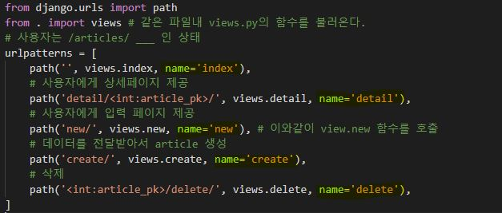
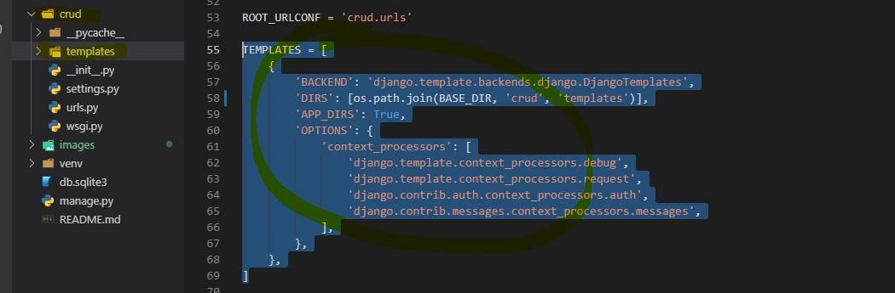

## Django

CRUD는 대부분의 컴퓨터 소프트웨어가 가지는 기본적인 데이터 처리 기능인 Create(생성), Read(읽기), Update(갱신), Delete(삭제)를 묶어서 일컫는 말이다. 사용자 인터페이스가 갖추어야 할 기능(정보의 참조/검색/갱신)을 가리키는 용어로서도 사용된다

### 가상환경

- 어떠한 프로그램을 만들 때, 독자적으로 파이썬의 고유 library 만을 써서 만들기도 하지만, 3rd patry library 를 사용하기도 한다. 즉, 의존성이 발생한다.
- 파이썬 환경 및 버전 등의 문제로 본인의 컴퓨터에서 잘 작동하던 프로그램도, 다른 환경에 설치했을 때 잘 돌아가리라는 보장을 할 수 없다.
- 때문에 특정 프로그램만을 실행하기 위한 파이썬 가상환경을 따로 만들어서, 그 환경 속에서 모듈을 관리하는 방식을 선택한다.

**가상환경 세팅**

- Scripts

### VS Code 및 기타 세팅

**VS Code 파이썬 가상환경 선택**

- `Ctrl + Shift + P` → `Python: Select Interpreter` → 방금 생성한 가상환경을 선택
- `.vscode/settings.json` 파일이 생성되고 가상환경 경로가 설정되어 있는지 확인, 터미널에서 자동으로 해당 가상환경이 적용 되는지 확인

**gitignore 세팅**

- [gitignore.io](https://www.gitignore.io/) 에서 프로그래밍 언어, 기술스택, OS 등 선택하여 알맞은 `.gitignore` 파일을 생성
- 생성된 파일을 `.gitignore` 파일에 붙여넣기

**VS Code Django 환경 세팅**

- `.vscode/settings.json` 파일에 django 관련 세팅을 추가 해준다.

:star: setting.py

```json
{
    "python.pythonPath": "venv\\Scripts\\python.exe",
    "files.associations": {
        "**/templates/*.html": "django-html",
        "**/templates/*": "django-txt",
        "**/requirements{/**,*}.{txt,in}": "pip-requirements",
    },
    "emmet.includeLanguages": {"django-html": "html"},
    "[django-html]": {
        "editor.tabSize": 2,
    },
}
```


:star: django-admin startproject crud .


:star: setting.py

```
LANGUAGE_CODE = 'ko-kr'
TIME_ZONE = 'Asia/Seoul'
```


:star: python manage.py startapp articles


:star: setting.py

가서 installedapp에 startapp으로 생성한 app 이름 추가


:star:    Model.py 

created_at = models.DateTimeField(**auto_now_add**=True) # add는 새로운 정보 추가시 처음에만 
updated_at = models.DateTimeField(**auto_now**=True) # 아무거나 정보 추가시 갱신

```python
from django.db import models

# Create your models here.


class Article(models.Model):
    title = models.CharField(max_length=20)
    content = models.TextField()
    created_at = models.DateTimeField(auto_now_add=True) # add는 새로운 정보 추가시 처음에만 
    updated_at = models.DateTimeField(auto_now=True) # 아무거나 정보 추가시 갱신
```


:star: 모델을 변경후 장고에게 선언

$ python manage.py **makemigrations**

```bash
$ python manage.py makemigrations
Migrations for 'articles':
  articles\migrations\0001_initial.py
    - Create model Article
(3.7.4)
```


:star: 알린후 반영 (schema  생성)

$ python manage.py **migrate**

```bash
$ python manage.py migrate
Operations to perform:
  Apply all migrations: admin, articles, auth, contenttypes, sessions
Running migrations:
  Applying contenttypes.0001_initial... OK
  Applying auth.0001_initial... OK
```


:star: Page 생성

3가지 스탭

- urls.py 정의
- app내에 urls.py 생성후, 앱 내에서 path 생성 
- path 생성 후 views.py에서 해당 함수를 생성하여 mapping 해준다.
- mapping 후 해당하는 html을 만드는 templates 폴더를 생성하고, 그 안에 해당 app이름으로 폴더를 하나 더 만든다.

- 그안에 html을 만든다.


:one:urls.py

from django.contrib import admin
from django.urls import path, **include**

urlpatterns = [
    :star:articles 로 들어왔다면 articles/urls.py로 이동
​    **path('articles/', include('articles.urls')),** 
​    path('admin/', admin.site.urls),
]

```python
from django.contrib import admin
from django.urls import path, include

urlpatterns = [
    # articles 로 들어왔다면 articles/urls.py로 이동
    path('articles/', include('articles.urls')), 
    path('admin/', admin.site.urls),
]
```


:two: html

앞에 꼭 /를 붙여야 동일한 application 내에서 이동한다.

new.html

```html
<form action="/articles/create/">
```

```html
<!DOCTYPE html>
<html lang="en">
<head>
  <meta charset="UTF-8">
  <meta name="viewport" content="width=device-width, initial-scale=1.0">
  <meta http-equiv="X-UA-Compatible" content="ie=edge">
  <title>NEW ARTICLE</title>
</head>
<body>
  <h1>NEW ARTICLE</h1>
  <form action="/articles/create/">
  <input type="text" name="title"><br>
  <textarea name="content" cols="30" rows="10"></textarea><br>
  <button type="submit">생성하기</button>
  </form>
</body>
</html>
```


:three: 

```

```


:star: 

```

```


:star: 

```

```


:star: 

```

```


:star: 

```

```


# Advanced1

이름 붙여주기



이름을 articles라는 name_space에 묶어주기


:heavy_check_m


templates extensions




# Advanced2

[REST API](https://meetup.toast.com/posts/92)

[https://velog.io/@city7310/%EB%B0%B1%EC%97%94%EB%93%9C%EA%B0%80-%EC%9D%B4%EC%A0%95%EB%8F%84%EB%8A%94-%ED%95%B4%EC%A4%98%EC%95%BC-%ED%95%A8-4.-API-%EC%84%A4%EA%B3%84-%EC%9B%90%EC%B9%99%EA%B3%BC-%EC%A7%81%EB%A0%AC%ED%99%94-%ED%8F%AC%EB%A7%B7-%EA%B2%B0%EC%A0%95](https://velog.io/@city7310/백엔드가-이정도는-해줘야-함-4.-API-설계-원칙과-직렬화-포맷-결정)

Representational State Transfer API

: 이렇게 만들면 좋아요 라고하는 구조

### REST API 구성

- **자원(RESOURCE)** - URI

- **행위(Verb)** - HTTP METHOD

  **GET은 가져오는 것이고 POST는 수행하는 것입니다.**

  - POST 
  - GET

  GET은 URL에 이어붙기 때문에 길이제한이 있어서 많은양의 데이터는 보내기 어렵고 POST는 많은 양의 보내기에도 적합하다.(역시 용량제한은 있지만)

  GET은 주소줄에 값이 ?뒤에 쌍으로 이어붙고 POST는 숨겨져서(body안에) 보내진다.

  즉 http://url/bbslist.html?id=5&pagenum=2 같이 하는 것이 GET방식이고 form을 이용해서 submit을 하는 형태가 POST입니다.

- **표현(Representations)**

### REST API 디자인 가이드

REST API 설계 시 가장 중요한 항목

**첫 번째,** URI는 정보의 자원을 표현해야 한다.
**두 번째,** 자원에 대한 행위는 HTTP Method(GET, POST, PUT, DELETE)로 표현한다.


#### 1) URI는 정보의 자원을 표현해야 한다. (리소스명은 동사보다는 명사를 사용)

```
    GET /members/delete/1
```

위와 같은 방식은 REST를 제대로 적용하지 않은 URI입니다. URI는 자원을 표현하는데 중점을 두어야 합니다. delete와 같은 행위에 대한 표현이 들어가서는 안됩니다.

#### 2) 자원에 대한 행위는 HTTP Method(GET, POST, PUT, DELETE 등)로 표현

위의 잘못 된 URI를 HTTP Method를 통해 수정해 보면

```
    DELETE /members/1
```

으로 수정할 수 있겠습니다.
회원정보를 가져올 때는 GET, 회원 추가 시의 행위를 표현하고자 할 때는 POST METHOD를 사용하여 표현

**회원정보를 가져오는 URI**

```
    GET /members/show/1     (x)
    GET /members/1          (o)
```

**회원을 추가할 때**

```
    GET /members/insert/2 (x)  - GET 메서드는 리소스 생성에 맞지 않습니다.
    POST /members/2       (o)
```

**HTTP METHOD의 알맞은 역할**
POST, GET, PUT, DELETE 이 4가지의 Method를 가지고 CRUD를 할 수 있습니다.

| METHOD |                             역할                             |
| :----: | :----------------------------------------------------------: |
|  POST  |     POST를 통해 해당 URI를 요청하면 리소스를 생성합니다.     |
|  GET   | GET를 통해 해당 리소스를 조회합니다. 리소스를 조회하고 해당 도큐먼트에 대한 자세한 정보를 가져온다. |
|  PUT   |             PUT를 통해 해당 리소스를 수정합니다.             |
| DELETE |              DELETE를 통해 리소스를 삭제합니다.              |


url은 리소스

method는 행위


url로 접근하는 방법과 페이지내에서 행위로 접근하는 방법을 나누기 위한 방법


# fun페이지

사용자로부터 이름을 입력받아 전생알려주기

```
# 전생 직업 찾기

## 페이지

### 이름 입력 페이지

- 해당 페이지에 접근하는 URL 은 `/jobs/` 입니다.
- `name` 을 입력할 수 있는 `form` 이 있으며 `form` 의 method 는 `POST` 입니다. `form` 은 `/jobs/past_job/` 으로 제출됩니다.

### 전생 직업 결과 페이지

- 해당 페이지에 접근하는 URL 은 `/jobs/past_job/` 입니다.
- `/jobs/` 에서 제출된 form 의 `name` 으로 저장된 직업을 데이터 베이스에서 찾아서 `past_job.html` 페이지에 표시합니다.
  - 단, `name` 으로 저장된 직업이 없을 시 `faker` 라이브러리를 통해 랜덤으로 직업 데이터를 생성하여 데이터베이스에 저장합니다.
```


가상환경 설정후 faker 설치

```bash
student@M702 MINGW64 ~/development/정승원_django_git/django/django_crud (master)
$ venv
(3.7.4)
student@M702 MINGW64 ~/development/정승원_django_git/django/django_crud (master)
$ pip install faker
```


```bash
student@M702 MINGW64 ~/development/정승원_django_git/django/django_crud (master)
$ python manage.py shell
Python 3.7.4 (tags/v3.7.4:e09359112e, Jul  8 2019, 20:34:20) [MSC v.1916 64 bit (AMD64)] on win32
Type "help", "copyright", "credits" or "license" for more information.
(InteractiveConsole)
>>> from faker import Faker
>>> fake = Faker()
>>> fake.name()
'Walter Davis'
>>> fake.job()
'Haematologist'
# 언어설정
>>> fake = Faker('ko_KR')
>>> fake.job()
'도장기 조작원'
```


```bash
student@M702 MINGW64 ~/development/정승원_django_git/django/django_crud (master)
$ python manage.py startapp jobs
(3.7.4)
```

installedapps에 추가후, 

models.py

```python
from django.db import models

# Create your models here.
class Job(models.Model):
    name = models.CharField(max_length=20)
    past_job = models.TextField()

    # job의 데이터 표현 설정
    def __str__(self):
        return self.name
```


```bash
student@M702 MINGW64 ~/development/정승원_django_git/django/django_crud (master)
$ python manage.py makemigrations
Migrations for 'jobs':
  jobs\migrations\0001_initial.py
    - Create model Job
(3.7.4)
student@M702 MINGW64 ~/development/정승원_django_git/django/django_crud (master)
$ python manage.py migrate
Operations to perform:
  Apply all migrations: admin, articles, auth, contenttypes, jobs, sessions
Running migrations:
  Applying jobs.0001_initial... OK
(3.7.4)
```


```
https://developers.giphy.com/docs/api

- 회원가입 하여 API Key 를 발급받는다.

https://developers.giphy.com/docs/api/endpoint

- 위 API 를 사용하여 past_job 에 맞는 gif 파일을 검색하여 화면에 함께 보여준다.
- 사용 라이브러리 : `requests`
  - `pip install requests`
```


# database: 1vsN 게시판 구현

의존성 띄는 테이블 구현

하나의 게시글 - 여러개의 댓글

댓글을 저장하는 방법

댓글을 어떻게 저장하는게 좋을까?


댓글이 어떤 게시글에 속하는지 article_pk로 연결(foreign key)한다.

이런것을 1vsN관계라고 한다.


```bash
student@M702 MINGW64 ~/development/정승원_django_git/django/django_crud (master)
$ venv
(3.7.4)
student@M702 MINGW64 ~/development/정승원_django_git/django/django_crud (master)
$ pip install django_extensions
Collecting django_extensions
  Using cached https://files.pythonhosted.org/packages/72/0d/fde2cf0ae7e1d12d105683d0259c17c151de4efd5d166c0ec1335541e7ba/django_extensions-2.2.1-py2.py3-none-any.whl
Requirement already satisfied: six>=1.2 in c:\users\student\python-virtualenv\3.7.4\lib\site-packages (from django_extensions) (1.12.0)
Installing collected packages: django-extensions
Successfully installed django-extensions-2.2.1
(3.7.4)

# settings의 INSTALLED_APPS에 'django_extensions'저장후

student@M702 MINGW64 ~/development/정승원_django_git/django/django_crud (master)
$ venv
(3.7.4)
student@M702 MINGW64 ~/development/정승원_django_git/django/django_crud (master)
$ python manage.py shell_plus

>>> article = Article()
>>> article.title = '새로운데이터'
>>> article.content = '새로운내용'
>>> article
<Article: Article object (None)>
>>> article.save()
>>> article
<Article: Article object (27)>
>>> comment = Comment()
>>> comment.content = 'First comment'
>>> comment.article = article # 객체자체를 통째로 넣어준다.

### 다음과 같이 진행
>>> article = Article()
>>> article.title = '새로운데이터'
>>> article.content = '새로운내용'
>>> article.save()
>>> comment = Comment()
>>> comment.content = 'First comment'
>>> comment.article = article
>>> comment.save()
>>> comment
<Comment: First comment>

# 다음과 같이 한번에 선언
>>> comment = Comment(article=article, content='Second')
>>> comment.save()
>>> comment.pk
3
>>> comment = Comment(article=article, content='4')
>>> comment.save()
>>> comment.pk
4
>>> comment
<Comment: 4>
>>> comment.content
'4'
>>> comment.article # 댓글 입장에서
<Article: Article object (28)>

# article에서 가능한 속성들을 나열하는 명령
>>> dir(article)
['DoesNotExist', 'MultipleObjectsReturned', '__class__', '__delattr__', '__dict__', '__dir__', '__doc__', '__eq__',
'__format__', '__ge__', '__getattribute__', '__getstate__', '__gt__', '__hash__', '__init__', '__init_subclass__', '__le__', '__lt__', '__module__', '__ne__', '__new__', '__reduce__', '__reduce_ex__', '__repr__', '__setattr__', '__setstate__', '__sizeof__', '__str__', '__subclasshook__', '__weakref__', '_check_column_name_clashes', '_check_constraints', '_check_field_name_clashes', '_check_fields', '_check_id_field', '_check_index_together', '_check_indexes',
'_check_local_fields', '_check_long_column_names', '_check_m2m_through_same_relationship', '_check_managers', '_check_model', '_check_model_name_db_lookup_clashes', '_check_ordering', '_check_property_name_related_field_accessor_clashes', '_check_single_primary_key', '_check_swappable', '_check_unique_together', '_do_insert', '_do_update', '_get_FIELD_display', '_get_next_or_previous_by_FIELD', '_get_next_or_previous_in_order', '_get_pk_val', '_get_unique_checks', '_meta', '_perform_date_checks', '_perform_unique_checks', '_save_parents', '_save_table', '_set_pk_val', '_state', 'check', 'clean', 'clean_fields', 'comment_set', 'content', 'created_at', 'date_error_message', 'delete', 'from_db', 'full_clean', 'get_deferred_fields', 'get_next_by_created_at', 'get_next_by_updated_at', 'get_previous_by_created_at', 'get_previous_by_updated_at', 'id', 'objects', 'pk', 'prepare_database_save', 'refresh_from_db', 'save', 'save_base', 'serializable_value', 'title', 'unique_error_message', 'updated_at', 'validate_unique']


>>> dir(article.comment_set)
['__call__', '__class__', '__delattr__', '__dict__', '__dir__', '__doc__', '__eq__', '__format__', '__ge__', '__getattribute__', '__gt__', '__hash__', '__init__', '__init_subclass__', '__le__', '__lt__', '__module__', '__ne__', '__new__', '__reduce__', '__reduce_ex__', '__repr__', '__setattr__', '__sizeof__', '__slotnames__', '__str__', '__subclasshook__', '__weakref__', '_apply_rel_filters', '_constructor_args', '_db', '_get_queryset_methods', '_hints', '_insert', '_queryset_class', '_remove_prefetched_objects', '_set_creation_counter', '_update', 'add', 'aggregate', 'all', 'annotate', 'auto_created', 'bulk_create', 'bulk_update', 'check', 'complex_filter', 'contribute_to_class', 'core_filters', 'count', 'create', 'creation_counter', 'dates', 'datetimes', 'db', 'db_manager', 'deconstruct', 'defer', 'difference', 'distinct', 'do_not_call_in_templates', 'earliest', 'exclude', 'exists', 'explain', 'extra', 'field', 'filter', 'first', 'from_queryset', 'get', 'get_or_create', 'get_prefetch_queryset', 'get_queryset', 'in_bulk', 'instance', 'intersection', 'iterator', 'last', 'latest', 'model', 'name', 'none', 'only', 'order_by', 'prefetch_related', 'raw', 'reverse', 'select_for_update', 'select_related', 'set', 'union', 'update', 'update_or_create', 'use_in_migrations', 'using', 'values', 'values_list']


## 다시 가져올때 
>>> article = Article.objects.get(pk=28)
>>> article
<Article: Article object (28)>
>>> comments = article.comment_set.all()
# article에 달린 댓글들을 queryset으로 가지고온다
# 마지막으로 달린 댓글이 먼저 가지고 와지는 것은 model에서 그렇게 정의했기 때문
>>> comments
<QuerySet [<Comment: 4>, <Comment: Second>, <Comment: First comment>]>
>>> article.comment_set.get(pk=3)
<Comment: Second>
>>> article.comment_set.filter(content='Second').first()
<Comment: Second>
>>> article.comment_set.filter(content='Second')
<QuerySet [<Comment: Second>]>
```

