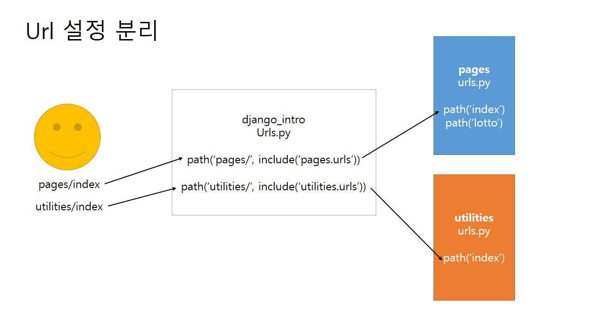
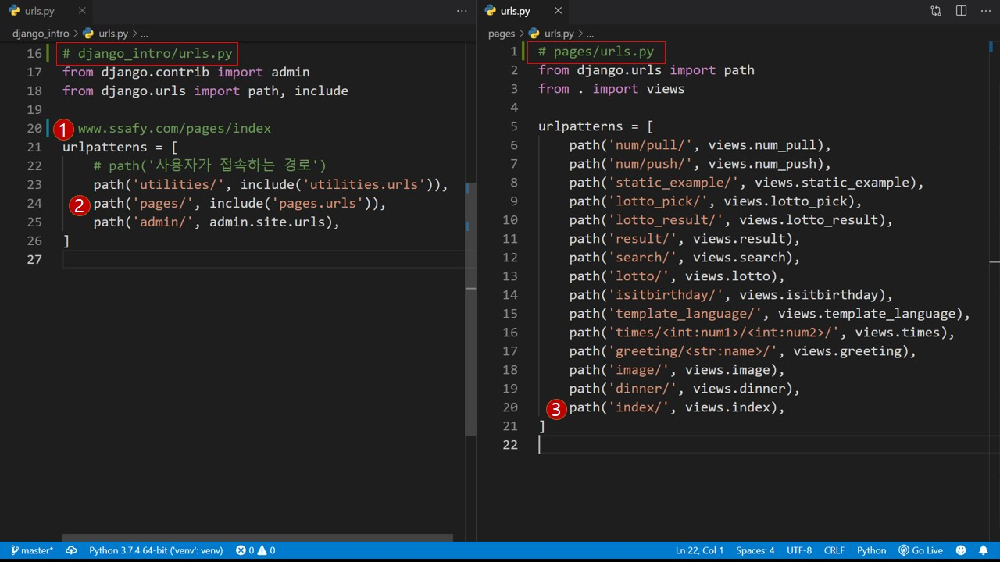
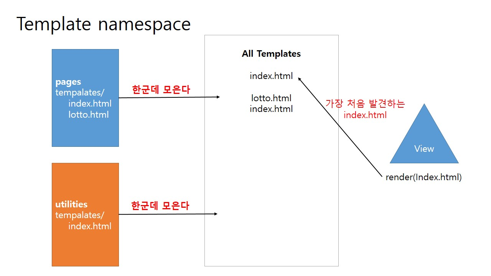

## Django

MDN web docs

https://developer.mozilla.org/ko/docs/Learn/Server-side/Django/Introduction

특징

**OPINIONATED!** 독선적이다.


MVC pattern

M : model 

V : view

C : controller


MTV

**M** : model 데이터 관리

**T** : template 사용자가 보는 화면

**V** : view(===controller) 중간 관리자

장고의 개발 방식은 MTV(Model, Template, View) 패턴을 따르며, 기본적으로 MVC와 많이 유사하다.
 데이터를 Model, view를 Template, controllerl는 View라고 표현하여 MTV(model-template-view)패턴 이라고 한다. 모델(Model)은 데이터베이스에 저장되는 데이터를 의미하고, 템플릿(Template)은 사용자에게 보여지는 부분을, 뷰(View)는 실질적으로 프로그램 로직이 동작하여 데이터를 가져오고 적절하게 가공하여 그 결과를 템플릿에 전달하는 역할을 수행

### Django Setting

#### 가상환경

새로운 장고 생성

- 프로젝트의 호환성, 의존성 확립

```bash
# 파이썬 버전 확인
# 반드시 3.7.x 버전이 맞는지 확인 후 진행
student@M702 MINGW64 ~/development/homeworkshop/django (master)
$ venv
(3.7.4)

student@M702 MINGW64 ~/development/django/django_intro (master)
$ python -V
Python 3.7.4
(3.7.4)

# 가상환경 생성
# -m (module의 약자)
# python -m venv < 가상환경 설치 경로 >
student@M702 MINGW64 ~/development/django/django_intro (master)
$ python -m venv venv
(3.7.4)

# 가상환경 적용
student@M702 MINGW64 ~/development/django/django_intro (master)
$ source venv/Scripts/activate
(venv)

# 파이썬 버전 확인
student@M702 MINGW64 ~/development/django/django_intro (master)
$ source venv/Scripts/activate
(venv) # 가상환경 적용 시 git bash에서 해당 환경 이름이 표시된다.
student@M702 MINGW64 ~/development/django/django_intro (master)
$ python -V
Python 3.7.4
(venv)

# 설치된 모듈 확인
(venv) # 라는 가상환경에서,
student@M702 MINGW64 ~/development/django/django_intro (master)
$ pip list
Package    Version
---------- -------
pip        19.0.3
setuptools 40.8.0
You are using pip version 19.0.3, however version 19.2.2 is available.
You should consider upgrading via the 'python -m pip install --upgrade pip' command.
(venv)

# pip upgrade
(venv) 
$ python -m pip install --upgrade pip 

# pip upgrade 확인
(venv) 
$ pip list
```


---

### VS Code 및 기타 세팅

#### VS Code 파이썬 환경 선택

- VS Code Extensions에서 `Python`과 `Django`설치

- `ctrl + shift + p => python: select interpreter => 방금  생성한 가상환경을 선택(.\venv\Scripts\python.exe)`
  - .vscode/settings.json 파일이 생성되며 터미널에서 자동으로 가상환경 적용되는 것을 확인

```bash
student@M702 MINGW64 ~/development/django/django_intro (master)
$ source c:/Users/student/development/django/django_intro/venv/Scripts/activate
(venv)
```

#### Git ignore 세팅

http://gitignore.io/

- gitignore.io에 접속해서 `python`, `django`, `windows`, `vscode ` 선택 후 생성
- touch .gitignore 파일 생성 후 붙여넣기


#### VS Code Django 환경 세팅

```json
{   
    // 파이썬 환경 선택 => 자동으로 해줌
    "python.pythonPath": "venv\\Scripts\\python.exe",
    
    // Django에서 사용되는 파일 타입에 대한 정의
    "files.associations": {
        "**/templates/*.html": "django-html",
        "**/templates/*": "django-txt",
        "**/requirements{/**,*}.{txt,in}": "pip-requirements"
    },

    // Django-html에서도  html-emmet을 적용
    "emmet.includeLanguages": {"django-html": "html"},

    // django-html에서 tab size를 2칸으로 고정
    "[django-html]": {
        "editor.tabSize": 2
    }
}
```


---

### Start Django project

#### Django 설치 

```bash
student@M702 MINGW64 ~/development/django/django_intro (master)
$ pip install django
```

- Django를 설치한 순간부터 `django-admin`이라는 command를 사용할 수 있게 된다.
- 이 command를 통해 django project에 여러가지 명령을 할 수 있다.


### Start project
```bash
student@M702 MINGW64 ~/development/django/django_intro (master)
$ django-admin startproject django_intro .
(venv)
student@M702 MINGW64 ~/development/django/django_intro (master)
$ python manage.py runserver
```

- 현재 디렉토리에서 django_intro 라는 이름으로 프로젝트(어플리케이션의 집합)를 시작하겠다.
- Django project name
  - `-` 캐릭터는 사용될 수 없다.
  - python과 django에서 이미 사용되는 이름은 사용하지 않는다.
    - django 라는 이름은 django 그 자체와 충돌하고, test라는 이름은 django 내부, 자체적으로 사용하는 이름이다.

#### Run server

```bash
$ python manage.py runserver
```

- ctrl + C 커맨드로 종료
- 기본적으로 `local host: 8000`에서 실행된다.


manage.py == root


settings.py ! Important 대소문자

```python
LANGUAGE_CODE = 'ko-kr'
TIME_ZONE = 'Asia/Seoul'
```


```html
# settings.json에 추가!

Configure you file association for Django HTML in the Language Mode menu or drop this in your settings for more precision:

"files.associations": {
    "**/templates/*.html": "django-html",
    "**/templates/*": "django-txt",
    "**/requirements{/**,*}.{txt,in}": "pip-requirements"
},


Emmet enthusiasts should have this to their configuration as well:

"emmet.includeLanguages": {"django-html": "html"},

"[django-html]": {"editor.tabsize": 2},
```

---

#### APP 생성

APP이란? 

user이라는 application에는 user관련만 담당한다. 

furniture이라는 application에는 furniture 관련만 담당한다.


결국 각각의 project별로 기능들이 구현되어 있다.

application을 만들어서 특정 project가 일을 할 수 있도록 만드는 것이다.


프로젝트/앱

앱: 

특정한 기능(블로그나 공공 기록물을 위한 데이터베이스나, 간단한 설문조사 앱)을 수행하는 웹 어플리케이션

프로젝트: 

이런 특정 웹 사이트를 위한 앱들과 각 설정들을 한데 묶어놓은 것 

다수의 앱을 포함할 수 있고, 앱은 다수의 프로젝트에 포함 가능

```bash
# application 생성
# python manage.py startapp < 문서이름 >

(venv) # 해당 가상환경에서,
student@M702 MINGW64 ~/development/django/django_intro (master)
$ python manage.py startapp pages
(venv)
```


**admin.py** 관리자페이지 customizing

apps.py app에 대한 정보가 입력되는 곳

```python
from django.apps import AppConfig


class PagesConfig(AppConfig):
    name = 'pages'
```

**models.py** 데이터 베이스 관리, 저장할 데이터를 정의

tests.py 테스트 코드 파일들 존재

**views.py** 사용자에게 보여질 페이지를 담당하는 함수 정의


settings.py

위에서 부터 인식을 한다. **! 중요**

```python
# Application definition

INSTALLED_APPS = [
    # Local apps
    'pages', # 꼭 추가!해야 인식한다.
    
    # Third party apps
    
    # Django apps 마지막에 오도록 setting
    'django.contrib.admin',
    'django.contrib.auth',
    'django.contrib.contenttypes',
    'django.contrib.sessions',
    'django.contrib.messages',
    'django.contrib.staticfiles',
]
```


프로젝트내의 urls.py에서

from <app 이름> import views

을 선언 후, url을 연결해준다.


그후 views에서 작성


app에 해당하는 folder안에서 

templates folder을 생성해서 앞으로 html 작성


**기본순서!**

1) urls.py에서 특정 탬플릿이 rendering 될 수 있도록 mapping하는 것 생성

2) view.py에서 만들고자 하는함수로 페이지 생성

3) templates를 만든다 -> 해당 폴더에서 html을 작성


#### 실습

url: image/

view:

```python
def image(request):
	# image url을 context에 담아서 image.html에 전달
```

template: image.html // 전달받은 image 을 img태그 src속성에 담아서 랜덤이미지를 보여준다.

m


url: times/

- variable routing으로 숫자 2개를 각각 int타입으로 num1, num2이름으로 받는다.

view:

```python
def times(request, num1, num2):
    # 두 숫자를 곱한 result 변수와 num1, num2를 context에 담아서 times.html에 전달
```

template: times.html // 전달받은 context의 값들을 알맞게 표시한다.

https://docs.djangoproject.com/ko/2.2/ref/templates/language/


---

https://docs.djangoproject.com/en/2.2/ref/templates/builtins/#for

### DTL Django template language


1. 반복문

```html

<p>{{ food }}</p>
  명시적으로 for문이 끝났음을 보여줘야 한다.  
<hr>

 
{{ forloop }} Django Template Language에서 자동으로 생성되는 객체


<p>{{ forloop.counter }} {{ food }}</p>
 
 1. 2. 3. 4. 숫자로 된 ol > li 형식이 생긴다. 
<hr>


<p> {{ user }}</p>

<p>현재 가입한 유저가 없습니다.</p>

<hr>
```

 

**띄어쓰기가 없고**, 붙여서 end한다.

2. 조건문

```html

<p>짜장면이 메뉴에 있습니다.</p>


 레몬은 menu에 없어서 p가 생기지 않는다. 

<p>레몬이 메뉴에 있습니다.</p>



 <p>{{ forloop.counter }}번째 도는 중..</p>
 
 <p>{{ food }} + tip</p>
 
 <p>{{ food }}</p>
 

<hr>
```


3.  length filter 활용

```html

 length가 5글자보다 길다면 

<p>{{ message }}, 글자가 너무 길어요.</p>

<p>{{ message }}, {{ message|length }}</p>


```


4. lorem ipsum

```html

```

   {{ lorem }}은 나오지 않는다. 사용자가 lorem을 넘겨주지 않았기 때문이다.


5. 글자 관련 필터: 글자 수 제한(truncate) 

   ** <!--django에서는 html 주석을 쓰지 말것-->

    django에서는 이 주석만 

```html
 단어 단위로 제한 
<p>{{ my_sentence|truncatewords:2 }}</p> 
 3을 넘으면 ...으로 잘라진다. 
 문자 단위로 제한 *3번째는 포함 
<p>{{ my_sentence|truncatechars:3 }}</p>
 문자 단위로 제한 *10번째는 포함 
<p>{{ my_sentence|truncatechars:10 }}</p>
```

   

6. 글자 관련 필터

```html
<p>{{ 'abc'|length }} </p>
<p>{{ 'ABC'|lower }}</p>
<p>{{ my_sentence|title }}</p>
<p>{{ 'abc def'|capfirst }}</p>
<p>{{ menu|random }}</p>
<hr>
```


7. 연산 ! 연산은 중괄호 두개

https://github.com/dbrgn/django-mathfilters

```html
{{ 4|add:6 }}
```


8. 날짜표현 !중요

```html
<p>{{ datetimenow }}</p>
<p></p>
<p></p>
<p></p>
<p></p>
<p></p>
<hr>

 current_year이라는 변수에 담아둬라 

<p>Copyright {{ current_year }}</p>

<hr>
{{ datetimenow|date:"DATE_TIME" }}
<hr>
```

9. 기타

```html
<p>{{ "google.com"|urlize }}</p>
```


---

#### 실습

is it birthday?

생일날짜랑 현재날짜를 비교해서

예, 아니요를 나오도록


isitbirthday/로 접속시 오늘 날짜와 본인 생일이 같다면 `예` 아니라면 `아니요`를 출력하는 페이지 구성

urls.py

```python
urlpatterns = [
    # path('사용자가 접속하는 경로')
    path('isitbirthday/<str:mybd>/', views.isitbirthday),
]

```

views.py

```python
def isitbirthday(request, mybd):
    dt = datetime.now()
    dt_new = dt.strftime('%m-%d')
    todaymonth = dt.strftime('%m')
    todayday = dt.strftime('%d')

    res = 'True'
    if dt_new != mybd:
        res = 'False'
    
    context = {
        'mybd': mybd,
        'dt_new': dt_new,
        'res': res,
        'todaymonth': todaymonth,
        'todayday': todayday,
    }
    return render(request, 'isitbirthday.html', context)
```

template.html

```html
<!DOCTYPE html>
<html lang="ko">
<head>
  <meta charset="UTF-8">
  <meta name="viewport" content="width=device-width, initial-scale=1.0">
  <meta http-equiv="X-UA-Compatible" content="ie=edge">
  <title>Document</title>
</head>
<body>
   isitbithday 

  
  <p>예! 생일 축하합니다! </p>
  
  <p>아니요. 오늘은 {{ todaymonth }}월 {{ todayday }}일 입니다! </p>
  

</body>
</html>
```


### Form

사용자와 상호작용하는 APPLICATION

form tag 설문지 ! 중요

input tag - radio, -checkbox, -password, -email

action property

button tag


urls.py

```python
urlpatterns = [
    path('result/', views.result),
    path('search/', views.search),
    ]
```

views.py

```python
def search(request):
    return render(request, 'search.html')

def result(request):
    query = request.GET.get('query')
    category = request.GET.get('category')
    context = {
        'query': query,
        'category': category,
    } 
    return render(request, 'result.html', context)
```

search.html

```html
<!DOCTYPE html>
<html lang="ko">
<head>
  <meta charset="UTF-8">
  <meta name="viewport" content="width=device-width, initial-scale=1.0">
  <meta http-equiv="X-UA-Compatible" content="ie=edge">
  <title>Document</title>
</head>
<style>
input {
  display: inline-block;
  width: 170px;
}
</style>
<body>
 / = 앞에서 result / = 으로 보내겠다. 
 action에서 끝에 '/' 을 꼭! 붙여야 한다. 
  <form action="/result/"> 
    category: <input type="text" name="category"><br>
    search:   <input type="text" name="query" placeholder="input your search keywords">
    <button type="submit">검색</button>
  </form>
</body>

</html>
```

result.html

```html
<!DOCTYPE html>
<html lang="ko">
<head>
  <meta charset="UTF-8">
  <meta name="viewport" content="width=device-width, initial-scale=1.0">
  <meta http-equiv="X-UA-Compatible" content="ie=edge">
  <title>result</title>
</head>
<body> 
  <h1>검색 결과입니다.</h1>
  <h1>category: {{ category }}</h1>
  <h1>search: {{ query }}</h1>
</body>
</html>
```


image는 application에 **static** folder를 생성해서 사용하고싶은 image를 보관한다.

.html에  을 반드시 표시한다.

주소가 있어야 참조가 가능하기 때문이다.

```html


<!DOCTYPE html>
<html lang="en">
<head>
  <meta charset="UTF-8">
  <meta name="viewport" content="width=device-width, initial-scale=1.0">
  <meta http-equiv="X-UA-Compatible" content="ie=edge">
  <link rel="stylesheet" href="">
  <title>Document</title>
</head>
<body>
<h1>STATIC 파일실습</h1>
<p>static_example입니다.</p>
 다른 컴퓨터에서도 접속 가능 

 아래는 다른 컴퓨터에서 접속시 접속 불가능 

</body>
</html>
```


### 개별 APPS에 개별 urls.py추가 연동

$ python manage.py startapp utilities








#### 실습

utilities/index/로 접속했을때 django_intro/urls.py에서 utilities/urls.py로 이동시킨 뒤 utilities/urls.py 에 정의된 index 결로를 통해 utilities의 index 페이지가 보여지도록 구현


### 개발환경 설치 Requirements.txt

```bash
개발환경 확인
$ pip list

개발환경 저장
$ pip freeze > requirements.txt

개발환경 설치
$ pip install -r requirements.txt
```

