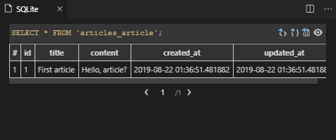
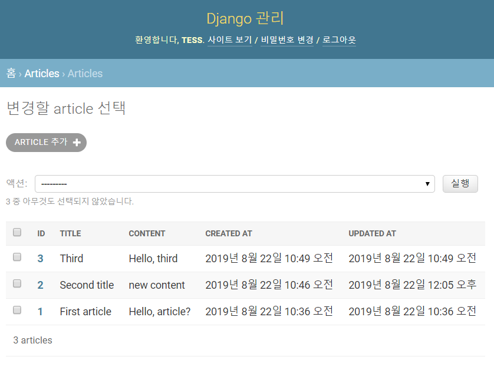

[TOC]

# Django ORM


### 데이터베이스(DB: Database)

- 체계화된 데이터의 모임

- 여러 사람이 **공유**하고 **사용**할 목적으로 통합 관리되는 정보의 집합

- 몇 개의 자료 파일을 조직적으로 통합하여 자료 항목의 중복을 없애고 자료를 구조화하여 기억시켜 놓은 자료의 집합체


### RDBMS(관계형데이터베이스 관리 시스템)


### 기본용어

**스키마(scheme)**

| column | datatype |
| ------ | -------- |
| id     | INT      |
| age    | INT      |
| phone  | TEXT     |
| email  | TEXT     |

**테이블(table)**

열(컬럼/필드)과 행(레코드/값)의 모델을 사용해 조직된 데이터 요소들의 집합. SQL 데이터베이스에서는 테이블을 관계 라고도 한다.


**행(row),레코드**

테이블의 데이터는 행에 저장된다.
즉, user 테이블에 4명의 고객정보가 저장되어 있으며, 행은 4개가 존재한다.


**PK(기본키)** 

각 행(레코드)의 고유값으로 Primary Key로 불린다.
반드시 설정하여야하며, 데이터베이스 관리 및 관계 설정시 주요하게 활용된다.


### ORM(Object-Relational Mapping)으로 구현하는 CRUD


models.py


models.py 작성후 선언

```bash
$ python manage.py makemigrations
Migrations for 'articles':
  articles\migrations\0001_initial.py
    - Create model Article
(venv)


# 데이터베이스에 반영 시작
student@M702 MINGW64 ~/development/django/django/django_orm (master)
$ python manage.py migrate
Operations to perform:
  Apply all migrations: admin, articles, auth, contenttypes, sessions
Running migrations:
  Applying contenttypes.0001_initial... OK
  Applying auth.0001_initial... OK
  Applying admin.0001_initial... OK
  Applying admin.0002_logentry_remove_auto_add... OK
  Applying admin.0003_logentry_add_action_flag_choices... OK
  Applying articles.0001_initial... OK # 우리가 만든 것
  Applying contenttypes.0002_remove_content_type_name... OK
  Applying auth.0002_alter_permission_name_max_length... OK
  Applying auth.0003_alter_user_email_max_length... OK
  Applying auth.0004_alter_user_username_opts... OK
  Applying auth.0005_alter_user_last_login_null... OK
  Applying auth.0006_require_contenttypes_0002... OK
  Applying auth.0007_alter_validators_add_error_messages... OK
  Applying auth.0008_alter_user_username_max_length... OK
  Applying auth.0009_alter_user_last_name_max_length... OK
  Applying auth.0010_alter_group_name_max_length... OK
  Applying auth.0011_update_proxy_permissions... OK
  Applying sessions.0001_initial... OK
(venv)
```


데이터 베이스 확인 extension 설치 


### create

### 기초설정

작성한 model에 접근하기 위해서 bash에서 다음을 명령

- Shell

```bash
student@M702 MINGW64 ~/development/django/django/django_orm (master)
$ python manage.py shell
Python 3.7.4 (tags/v3.7.4:e09359112e, Jul  8 2019, 20:34:20) [MSC v.1916 64 bit (AMD64)] on win32
Type "help", "copyright", "credits" or "license" for more information.
(InteractiveConsole)
>>>
```

- Import model
```bash
>>> from articles.models import Article
```


### 데이터를 저장하는 3가지 방법

1. 첫번째 방식
   - ORM을 쓰는 이유: DB를 조작 방식을 객체지향 프로그래밍(클래스) 처럼 하기 위해서

```bash
>>> Article.objects.all() # objects는 DB에 접근해서 명령을 내리는 객체 * 앞으로 모든 명령은 objects를 통해서 명령!
# 변수명.objects.함수
<QuerySet []> # 어떠한 정보도 가지고있지 않아서 [] 비어있다!
```


```bash
>>> article = Article()
>>> article
<Article: Article object (None)> # 객체임을 확인 가능

>>> article.title = 'First article'
>>> article.content = 'Hello, article?'

>>> article.title
'First article'
>>> article.content
'Hello, article?'

>>> article.save() # 데이터 저장
>>> article
<Article: Article object (1)> # id값이 생성되면서, id값이 보여진다.
```


위 처럼, DB에 해당 데이터가 저장되면서 동시에 id(Primary key)값이 생긴 것을 확인 할 수 있다.

```bash
>>> Article.objects.all()
<QuerySet [<Article: Article object (1)>]> # 채워져있다!
```


2. 두번째 방식
   - 함수에서 Keyword 인자 넘기기 방식과 동일

```bash
>>> article = Article(title='Second title', content='Hello, second article')
>>> article.save()
```

3. 세번째 방식
   - create를 사용하면 쿼리셋 객체를 생성하고 저장하는 로직이 한 번의 스텝


```bash
>>> Article.objects.create(title='Third', content='Hello, third')
<Article: Article object (3)>
>>> article.save()
```

4. 검증
   - full_clean() 함수를 통해 저장하기 전 데이터를 검증할 수 있다.


```bash
>>> article.full_clean()
```


### **Article.objects.all()**의 객체 표현 변경

```bash
>>> Article.objects.all()
<QuerySet [<Article: Article object (1)>, <Article: Article object (2)>, <Article: Article object (3)>]>
```

객체 표현 변경

- articles/models.py에서 객체표현을 변경하는 def 함수 정의


```python
class Article(models.Model): # django Model을 상속 받는다.
    # id(pk)는 기본적으로 처음 테이블 생성시 자동으로 만들어진다.
    # database는 primary key PK 가 반드시 있어야 한다.
    # id = models.AutoField(primary_key=True)

    # 모든 필드는 기본적으로 NOT NULL -> 비어있으면 안된다.

    # CharField에서는 max_length가 필수 인자다.
    title = models.CharField(max_length=20) # 클래스 변수 (DB 필드)
    content = models.TextField() # 클래스 변수 (DB 필드)
    created_at = models.DateTimeField(auto_now_add=True) # 자동으로 지금 추가되었을때
    updated_at = models.DateTimeField(auto_now=True) # 수정이 가해질때 해당 시간을 추가

    
    ########## 정의
    def __str__(self):
        return f'{self.id}번 글 - {self.title} : {self.content}'

```


```bash
student@M702 MINGW64 ~/development/django/django/django_orm (master)
$ python manage.py shell
Python 3.7.4 (tags/v3.7.4:e09359112e, Jul  8 2019, 20:34:20) [MSC v.1916 64 bit (AMD64)] on win32
Type "help", "copyright", "credits" or "license" for more information.
(InteractiveConsole)
>>> from articles.models import Article
>>> Article.objects.all()
# 다시 시작하면, 아래와 같이 표현 변경이 됨
<QuerySet [<Article: 1번 글 - First article : Hello, article?>, <Article: 2번 글 - Second title : Hello, second article>, <Article: 3번 글 - Third : Hello, third>]>
```


### READ


- DB에 저장된 글중에서 title이 'Second title'인 것만 가져오기


```bash
>>> Article.objects.filter(title='Second title')
<QuerySet [<Article: 2번 글 - Second title : Hello, second article>]>
```

- querySet = Article.objects.filter(title='Second title')

```bash
>>> querySet = Article.objects.filter(title='Second title')
>>> querySet
<QuerySet [<Article: 2번 글 - Second title : Hello, second article>]>

# 없으면 그냥 빈 리스트를 준다
>>> Article.objects.filter(pk=10)
<QuerySet []>

# first()와 last() 사용
>>> querySet.first()
<Article: 2번 글 - Second title : Hello, second article>
>>> Article.objects.filter(title='Second title').last()
<Article: 2번 글 - Second title : Hello, second article>
```

- DB에 저장된 글 중에서 pk가 1인 글만 가지고 오기

  ***pk만 `get()`으로 가지고 올 수 있다.** 

```bash
>>> Article.objects.get(pk=1)
<Article: 1번 글 - First article : Hello, article?>

# filter()와는 달리 error을 준다.
>>> Article.objects.get(pk=10)
Traceback (most recent call last):
  File "<console>", line 1, in <module>
  File "C:\Users\student\development\django\django\django_orm\venv\lib\site-packages\django\db\models\manager.py", line 82, in manager_method
    return getattr(self.get_queryset(), name)(*args, **kwargs)
  File "C:\Users\student\development\django\django\django_orm\venv\lib\site-packages\django\db\models\query.py", line 408, in get
    self.model._meta.object_name
articles.models.Article.DoesNotExist: Article matching query does not exist.
```

- 오름차순
```bash
>>> articles = Article.objects.order_by('pk')
>>> articles
<QuerySet [<Article: 1번 글 - First article : Hello, article?>, <Article: 2번 글 - Second title : Hello, second article>, <Article: 3번 글 - Third : Hello, third>]>
```

- 내림차순

```bash
>>> articles = Article.objects.order_by('-pk') # - 를 붙여준다.
>>> articles
<QuerySet [<Article: 3번 글 - Third : Hello, third>, <Article: 2번 글 - Second title : Hello, second article>, <Article: 1번 글 - First article : Hello, article?>]>
```

- QuerySet은 list처럼 index접근이 가능해서 Slicing이 가능하다.

Indexing
```bash
>>> article = articles[2]
>>> article
<Article: 1번 글 - First article : Hello, article?>
```
Slicing

```bash
>>> articles = Article.objects.all()[1:3]
>>> articles
<QuerySet [<Article: 2번 글 - Second title : Hello, second article>, <Article: 3번 글 - Third : Hello, third>]>
```
- like - 문자열을 포함하는 값을 가지고 온다.

```bash
>>> articles = Article.objects.filter(title__contains='e') # double underscores
>>> articles
<QuerySet [<Article: 1번 글 - First article : Hello, article?>, <Article: 2번 글 - Second title : Hello, second article>]>
```
- start**s**with 

```bash
>>> articles = Article.objects.filter(title__startswith='First')
>>> articles
<QuerySet [<Article: 1번 글 - First article : Hello, article?>]>
```
- end**s**with

```bash
>>> articles = Article.objects.filter(content__endswith='third')
>>> articles
<QuerySet [<Article: 3번 글 - Third : Hello, third>]>
```


### UPDATE

article 의 content내용을 새롭게 정의한다.

```bash
>>> article = Article.objects.get(pk=2)
>>> article.content
'Hello, second article'
>>> article.content = 'new content'
>>> article.save()
```


### django/admin 페이지 시작

admin.py

```python
from django.contrib import admin
from .models import Article # 동일한 app에 있는 models에서 Article 호출

# Register your models here.
@admin.register(Article)  # admin site에 Article을 register
class ArticleAdmin(admin.ModelAdmin):
    list_display = ('id', 'title', 'content', 'created_at', 'updated_at')
```

```bash
$ python manage.py createsuperuser
사용자 이름 (leave blank to use 'student'): 
이메일 주소: 
Password:
Password (again):
Superuser created successfully.
(venv)

$ python manager.py runserver
C:\Users\student\AppData\Local\Programs\Python\Python37\python.exe: can't open file 'manager.py': [Errno 2] No such file or directory
(venv)

$ python manage.py runserver
```



